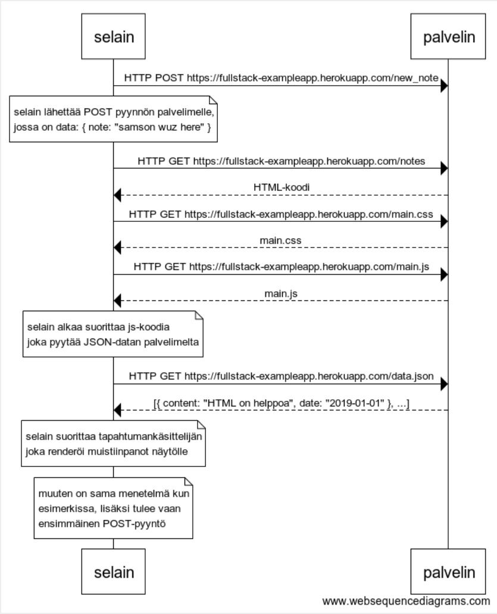

# OSA 0
Tästä löytyy minun "Osa 0":aan liittyvät tehtävät

## 0.4

### Skripti
```
selain->palvelin: HTTP POST https://fullstack-exampleapp.herokuapp.com/new_note

note over selain:
selain lähettää POST pyynnön palvelimelle,
jossa on data: { note: "samson wuz here" }
end note

selain->palvelin: HTTP GET https://fullstack-exampleapp.herokuapp.com/notes
palvelin-->selain: HTML-koodi
selain->palvelin: HTTP GET https://fullstack-exampleapp.herokuapp.com/main.css
palvelin-->selain: main.css
selain->palvelin: HTTP GET https://fullstack-exampleapp.herokuapp.com/main.js
palvelin-->selain: main.js

note over selain:
selain alkaa suorittaa js-koodia
joka pyytää JSON-datan palvelimelta
end note

selain->palvelin: HTTP GET https://fullstack-exampleapp.herokuapp.com/data.json
palvelin-->selain: [{ content: "HTML on helppoa", date: "2019-01-01" }, ...]

note over selain:
selain suorittaa tapahtumankäsittelijän
joka renderöi muistiinpanot näytölle
end note

note over selain:
muuten on sama menetelmä kun
esimerkissa, lisäksi tulee vaan
ensimmäinen POST-pyyntö 
end note
```

### Kuva



## 0.5

### Skripti
```
selain->palvelin: HTTP GET https://fullstack-exampleapp.herokuapp.com/spa
palvelin-->selain: HTML-koodi
selain->palvelin: HTTP GET https://fullstack-exampleapp.herokuapp.com/main.css
palvelin-->selain: main.css
selain->palvelin: HTTP GET https://fullstack-exampleapp.herokuapp.com/main.js
palvelin-->selain: main.js

note over selain:
selain alkaa suorittaa js-koodia
joka pyytää JSON-datan palvelimelta
end note

selain->palvelin: HTTP GET https://fullstack-exampleapp.herokuapp.com/data.json
palvelin-->selain: [{ content: "HTML on helppoa", date: "2019-01-01" }, ...]

note over selain:
selain suorittaa js koodin viimeisimman osuuden:
redrawNotes(), joka tulostaa muistiinpanot selaimeen
end note
```

### Kuva


## 0.6

### Skripti

```
selain->palvelin: HTTP POST https://fullstack-exampleapp.herokuapp.com/new_note
palvelin-->selain: {"message":"note created"}

note over selain:
Tässä tilantessa tapahtuu vain yksi POST pyyntö
Palvelin vastaa, että muistiinpano on luotu
Renderöinti tapahtuu selaimen päässä
Muistiinpanojen JSON-dataa ei haeta uudestaan,
Uusi muisiinpano lisätään ainoastaan selaimen päässä.
end note
```

### Kuva

